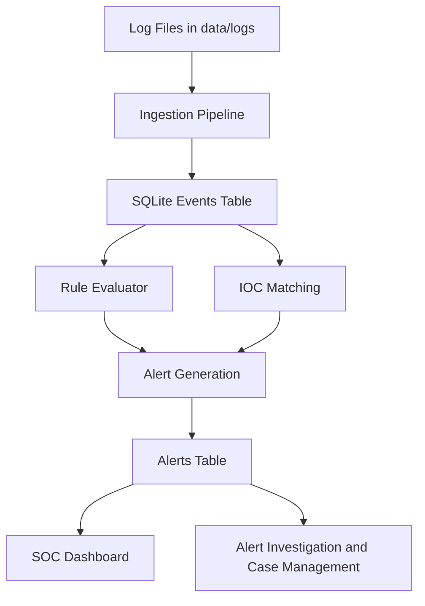

# DecodeX — Threat Hunting Platform

## Full Project Report
*DecodeX Security Technologies Private Limited*

## 1. Introduction

DecodeX is an advanced security monitoring and detection engineering platform developed by **DecodeX Security Technologies Private Limited**, designed to simulate and empower the core workflow of a modern Security Operations Center (SOC). The system collects logs, stores them in a database, evaluates them against hunting rules, enriches alerts with MITRE ATT&CK context, and presents the output in a web-based dashboard for investigation and case tracking.

This project started as a local file-based detection engine that read from a static log file and generated alerts. Over time, it was expanded into a more complete SOC-style platform with:

- persistent alert storage
- multi-source log ingestion
- case management
- suppression tuning
- Sigma import support
- IOC feed synchronization
- analytics and MITRE summaries
- authenticated dashboard access
- websocket live status updates
- webhook-based live log ingestion for cloud log drains

The result is a much stronger prototype that not only demonstrates detection logic, but also mirrors how real monitoring platforms are structured.

## 2. Objective

The main objectives of this project are:

- To build a practical threat hunting platform that can detect suspicious activities from logs.
- To provide a SOC-style interface for viewing, investigating, and managing detections.
- To enrich alerts with MITRE ATT&CK mappings for better contextual understanding.
- To support both local log ingestion and modern live ingestion methods such as webhook receivers.
- To create a project that is technically strong enough for learning, demos, interviews, and portfolio presentation.

## 3. Scope

The scope of this project includes:

- collection of logs from local files and webhook POST requests
- ingestion of endpoint, authentication, firewall, and similar structured logs
- IOC-based detection for IPs, domains, and hashes
- rule-based detection using YAML rules
- Sigma rule conversion into local rules
- alert creation, persistence, and display
- analyst workflow features such as case status and notes
- suppression rules to reduce noise
- IOC feed syncing
- analytics for hosts, tactics, and alert trends
- authenticated web dashboard

The project does not yet aim to be a full enterprise SIEM. It is currently a strong prototype that demonstrates the core concepts and architecture of such systems.

## 4. Project Requirements

### Functional Requirements

- The platform must ingest logs from one or more sources.
- The platform must store ingested events in SQLite.
- The platform must evaluate rules against ingested logs.
- The platform must match against IOC data.
- The platform must create alerts for matching events.
- The platform must store alerts for later review.
- The platform must display alerts in a dashboard.
- The platform must support case status updates and analyst notes.
- The platform must support authenticated user access.
- The platform must support live ingestion through an API endpoint.

### Non-Functional Requirements

- The platform should be modular and extensible.
- The platform should avoid duplicate event and alert creation where possible.
- The platform should be readable and understandable for academic and portfolio use.
- The platform should simulate realistic SOC workflows.
- The platform should be lightweight enough to run locally.

### Technical Requirements

- Python
- Flask
- SQLAlchemy
- SQLite
- PyYAML
- Requests
- Rich
- Flask-Sock for websocket support

## 5. Architecture Overview

The project currently contains the following major components:

- `db.py`
  Defines the database models for events, IOCs, alerts, users, feed sources, suppression rules, and ingestion state.

- `pipeline.py`
  Contains the ingestion, evaluation, persistence, suppression, analytics, Sigma import, and summary logic.

- `rule_evaluator.py`
  Evaluates events against YAML-based rules and maps them to alert objects.

- `feed_collector.py`
  Syncs threat intelligence feeds into the local IOC store.

- `sigma_importer.py`
  Converts supported Sigma rules into local rule format.

- `webapp.py`
  Hosts the SOC dashboard, login system, analytics pages, alert detail pages, Sigma import page, live feed sync endpoint, health API, websocket summary feed, and webhook receiver for live log ingestion.

- `templates/`
  Contains the HTML pages for login, dashboard, alert details, analytics, Sigma import, and shared layout.

## 6. Core Workflow

### Flowchart: Standard Local Ingestion Workflow



### Explanation

1. Logs are read from local files in `data/logs`.
2. Each record is parsed into an event object.
3. The event is stored in the database if it is not a duplicate.
4. The event is compared against rule conditions and IOC sets.
5. Matching events generate alerts.
6. Alerts are saved in the database.
7. The dashboard and investigation pages display those alerts.

## 7. Changes And Improvements Completed So Far

### Phase 1: Structural Stabilization

- Fixed import and packaging issues for the `src/` project layout.
- Standardized the database path handling.
- Improved CLI execution flow.
- Added better documentation and setup guidance.

### Phase 2: Database And Rule Engine Expansion

- Added `domain` and `file_hash` support to events.
- Added IOC timestamps (`first_seen`, `last_seen`).
- Added persistent alert storage.
- Added alert deduplication logic.
- Added MITRE ATT&CK mapping support to rules.
- Added analytics summarization logic.

### Phase 3: Dashboard Enhancement

- Replaced the plain page with a SOC-style dashboard.
- Added summary cards.
- Added ATT&CK tactic summaries.
- Added severity breakdowns.
- Added event timeline and IOC inventory displays.
- Added websocket summary support.

### Phase 4: SOC Workflow Features

- Added login and logout.
- Added a default admin account.
- Added alert detail view.
- Added case management with statuses:
  - Open
  - In Progress
  - False Positive
  - Resolved
- Added analyst notes and assignment fields.

### Phase 5: Detection Engineering Expansion

- Added Sigma import support.
- Added sample Sigma file.
- Added suppression rules and suppression creation flow.
- Added support for multiple log files and source types.
- Added sample `auth.log` and `firewall.log`.
- Added IOC feed source records and feed synchronization workflow.

### Phase 6: Live Ingestion Upgrade

- Added authenticated webhook receiver endpoint:
  - `POST /api/ingest_logs`
- Added API-key validation through the `X-API-Key` header.
- Added support for custom source metadata through headers:
  - `X-Source-Name`
  - `X-Source-Type`
- Added payload parsing for single-event or batched-event JSON payloads.
- Added immediate processing and alert generation after webhook ingestion.

## 8. Live Log Ingestion For Cloud Providers

Modern cloud providers such as Vercel do not require the platform to fetch log files manually. Instead, they push logs to an HTTP endpoint using a concept called a Log Drain.

This project has now been extended to support that architecture through an ingestion API endpoint in the Flask app.

### Flowchart: Live Log Drain / Webhook Workflow

```mermaid
flowchart TD
    A[Vercel or Cloud Provider] -->|HTTP POST| B[/api/ingest_logs]
    B --> C[API Key Validation]
    C --> D[Parse JSON Payload]
    D --> E[Store Events in SQLite]
    E --> F[Run Rule Evaluator]
    F --> G[Persist Alerts]
    G --> H[Dashboard / Alert Detail View]
```

### How It Works

1. The cloud provider sends logs to `POST /api/ingest_logs`.
2. The request must include a valid API key in the `X-API-Key` header.
3. The app accepts JSON payloads as either:
   - a single log object
   - a list of log objects
   - an object containing a `logs` list
4. Each log is converted into an internal event format.
5. The event is stored in the `events` table.
6. The rule evaluator checks the new events against detection logic and IOC data.
7. Any matching alerts are persisted and immediately become visible in the dashboard.

### Authentication Model

The webhook receiver uses a shared API key configured through:

- environment variable: `THREAT_API_KEY`

If not set, the prototype defaults to:

- `change-me-ingest-key`

This prevents random unauthorized sources from pushing fake logs into the system.

## 9. Current Web Features

The authenticated web application now includes:

- `/login`
  Login page for analysts

- `/`
  Main SOC dashboard

- `/alerts/<id>`
  Full alert investigation page

- `/alerts/<id>/case`
  Case update handler

- `/analytics`
  Analytics and MITRE heatmap summary page

- `/rules/sigma`
  Sigma import page

- `/feeds/sync`
  IOC feed sync action

- `/api/health`
  Authenticated health endpoint

- `/api/ingest_logs`
  Webhook receiver for live cloud log ingestion

- `/ws/live`
  Websocket summary channel

## 10. Security Features Implemented

- Login protection for dashboard and internal pages
- Password hashing for stored user credentials
- API key verification for live ingestion webhook
- Suppression rule mechanism to reduce alert fatigue
- Alert deduplication to reduce repeated noise

## 11. Current Limitations

Even though the platform is now much more advanced, there are still some limitations:

- It still uses SQLite, which is fine for prototyping but not ideal for large-scale deployments.
- The websocket support depends on `Flask-Sock` being installed.
- Feed synchronization depends on runtime network access.
- Sigma support currently handles supported field-based conversions, not the full Sigma standard.
- The dashboard uses simple HTML/CSS templates and not a dedicated front-end framework.

## 12. Future Scope

The project can be extended further with:

- better chart rendering libraries for richer analytics
- more advanced Sigma compatibility
- role-based access control
- token rotation for ingestion API security
- alert correlation across multiple events
- long-term retention strategies
- support for more SIEM-style parsers
- cloud-native deployments

## 13. Conclusion

This project has evolved from a basic local threat hunting script into a much more complete SOC-style platform. It now supports detection engineering, alert persistence, investigation workflows, Sigma rule import, live IOC sync, authenticated user access, and webhook-based live ingestion.

Most importantly, it now reflects the architectural model of real-world modern SIEM and SOC systems:

- logs come from multiple sources
- logs can arrive live from cloud providers
- events are normalized and stored
- rules and IOC logic generate alerts
- alerts are enriched, stored, investigated, and managed

That makes this project a strong prototype for demonstrations, interviews, academic submissions, and future real-world expansion.
