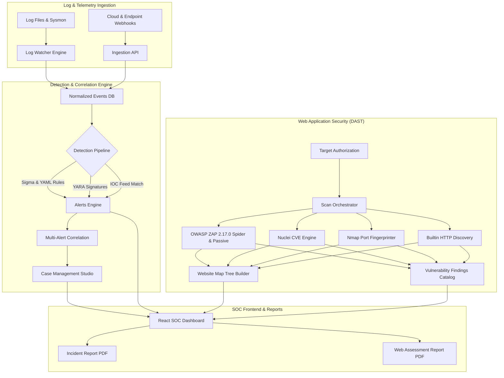

# DecodeX — Threat Hunting, SIEM & Web Application Security Platform

[](https://opensource.org/licenses/MIT)
[](https://github.com/Decoder420/Threat-Hunting-Platform/actions/workflows/codeql.yml)
[](docker-compose.yaml)
[](backend/)
[](frontend/)
[](https://www.zaproxy.org/)

**DecodeX** is an enterprise-grade Security Operations Center (SOC), Threat Hunting, and Web Application Security (DAST) platform developed by **DecodeX Security Technologies Private Limited**. 

The platform bridges real-time SIEM event correlation, threat intelligence matching, and automated endpoint response with active web attack surface discovery, multi-engine vulnerability scanning (OWASP ZAP, Nuclei, Nmap), interactive attack surface tree mapping, and executive PDF reporting.

---

## 🌟 Key Capabilities & Modules

### 1. 🛡️ Security Operations Center (SOC) & Detection Engineering
- **Real-Time Log Ingestion**: High-throughput file-watcher and webhook ingestion (`POST /api/ingest_logs`) supporting Sysmon, Windows Event Logs, Linux auth logs, and web server telemetry.
- **Rule Engine & Sigma Packages**: YAML-based Sigma detection rules with nested MITRE ATT&CK tactics, techniques, and automated alert scoring.
- **YARA Binary Analysis**: In-memory rule compilation and malware pattern matching.
- **Multi-Stage Attack Correlation**: Auto-correlates multi-alert attack campaigns into unified incident timelines.
- **Threat Intelligence Watchlist**: IOC store supporting IPv4, Domains, Hashes, and URLs with automatic background feed synchronization, confidence scoring, and one-click reputation lookups (AbuseIPDB, VirusTotal).
- **False-Positive Tuning**: In-memory and persistent suppression rules to silence benign administrative operations.
- **SOAR Simulated Response**: Role-gated containment actions (Host Isolation, Firewall IP Blocking, Process Termination) with comprehensive audit logging.

### 2. 🔍 Alerts Triage & Case Management Studio
- **Live Detections Workbench**: Filter by Severity (`CRITICAL`, `HIGH`, `MEDIUM`, `LOW`, `INFO`), Status (`OPEN`, `INVESTIGATING`, `CLOSED`, `FALSE_POSITIVE`), Host, and MITRE Tactic.
- **Alert Forensics Drawer**: Deep inspection of raw event payloads, process paths, users, command lines, and clickable MITRE ATT&CK technique references.
- **Incident Case Management**: Escalation studio with complete lifecycle tracking (`OPEN` → `IN_PROGRESS` → `CONTAINED` → `RESOLVED` → `CLOSED`), analyst notes log, and linked IOC registries.
- **Threat Hunting Playbooks**: One-click hunt presets targeting:
  - ⚡ *Suspicious PowerShell & Script Execution* (`-enc`, `bypass`, `downloadstring`)
  - 🔑 *Credential Access & LSASS Probing* (`mimikatz`, `sekurlsa`, `lsass`)
  - 🌐 *Lateral Movement & Remote Services* (`psexec`, `wmic`, `winrm`)
  - 🛡️ *Defense Evasion & Security Disabling* (`net stop`, `sc stop`, `Set-MpPreference`)
  - 📦 *Living-off-the-Land Binaries (LOLBAS)* (`certutil`, `bitsadmin`, `rundll32`)

### 3. 🌐 Web Application Security & DAST Scanning
- **Multi-Engine Orchestration**:
  - **OWASP ZAP 2.17.0 Daemon**: Full recursive web spidering, AJAX crawling, and passive vulnerability analysis.
  - **ProjectDiscovery Nuclei**: CVE vulnerability templates and misconfiguration checking.
  - **Nmap Engine**: Perimeter service discovery and open port fingerprinter.
  - **Built-in HTTP Engine**: TLS/SSL validation, HTTP security headers, insecure cookies, and technology stack identification.
- **Live Attack Surface Tree (Website Map)**:
  - Real-time auto-expanding hierarchical tree streaming discovered domains, subdomains, paths, and leaf endpoints as scans progress.
  - Node inspection showing HTTP response codes, response times, and linked vulnerability findings.
- **Web Security Assessment Reports (PDF)**:
  - Executive multi-page PDF generation matching dark-navy SOC design standards.
  - Includes document metadata (`WAS-YYYY-XXX`), Executive Summary, Severity KPI matrix, Target Attack Surface posture, Detailed Vulnerability Catalog, and CWE/OWASP remediation roadmap.
- **SSRF & Safety Guardrails**:
  - Strict private IP/loopback address firewalling to protect internal infrastructure.
  - Configurable Lab Mode (`WEBSCAN_ALLOW_PRIVATE_TARGETS=true`) for internal testing environments.
  - Strict target authorization workflow requiring explicit administrative sign-off before scanning.

### 4. 📄 Executive Reporting & Compliance
- **SOC Incident Reports**: Multi-page PDF generator detailing incident narratives, attacker methodology, kill chain diagrams, root causes, and sign-off blocks.
- **Web Assessment Reports**: Formal DAST vulnerability assessment documents downloadable directly from the Scanner Wizard, History, or Website Map.
- **Immutable Forensic Audit Trail**: Append-only log tracking authentication, user management, SOAR execution, and scan authorizations.

---

## 🏗️ Platform Architecture



---

## 🛠️ Technology Stack

| Layer | Technologies |
|---|---|
| **Backend API** | Python 3.11, Flask, SQLAlchemy, Eventlet, Gunicorn, Celery/Threads |
| **Frontend UI** | React 18, React Router v6, Recharts, Mantine UI, Socket.IO client |
| **Web Security Engines** | OWASP ZAP v2.17.0, ProjectDiscovery Nuclei, Nmap 7.95, Built-in HTTP |
| **Detection & Threat Intel** | PyYAML, YARA 4.5+, Threat Intel Feeds (C2, Phishing, Hashes) |
| **Reporting & Document Engine** | ReportLab PDF Engine (A4, multi-page, customized SOC palette) |
| **Deployment & Gateway** | Docker, Docker Compose, Nginx Reverse Proxy |
| **Code Quality & Security** | GitHub Actions, CodeQL Security Analysis, Dependabot |

---

## 🚀 Quickstart Guide

### Option 1: Docker Compose (Recommended)

The easiest way to run the entire platform (Backend, Frontend, OWASP ZAP, Nginx) is via Docker Compose:

1. **Clone the Repository**:
   ```bash
   git clone https://github.com/Decoder420/Threat-Hunting-Platform.git
   cd Threat-Hunting-Platform
   ```

2. **Configure Environment Variables**:
   ```bash
   cp backend/.env.example backend/.env
   # Edit backend/.env if you want custom administrative passwords
   ```

3. **Start All Services**:
   ```bash
   docker compose up -d --build
   ```

4. **Access the Platform**:
   - **URL**: `http://localhost`
   - **Default Admin**: `admin` / `Manan@123` (or the password configured in `backend/.env`)
   - **OWASP ZAP Daemon**: Runs internally on port `8080` (accessible to the backend scanner)

---

### Option 2: Local Development Setup

#### Prerequisites
- Python 3.10+
- Node.js v18+ and npm
- (Optional) OWASP ZAP, Nuclei, Nmap installed on PATH

#### 1. Backend Setup
```bash
cd backend
python3 -m venv .venv
source .venv/bin/activate   # Linux/macOS
# .venv\Scripts\activate    # Windows

pip install -r requirements.txt
cp .env.example .env

# Set admin credentials and launch
export TH_ADMIN_PASSWORD="YourSecurePassword123!"
export PYTHONPATH=src
python -m th.webapp
# Backend runs on http://127.0.0.1:5000
```

#### 2. Frontend Setup
```bash
cd frontend
npm install
npm start
# Frontend runs on http://localhost:3000
```

---

## 👥 Default User Accounts & RBAC Matrix

The platform includes enterprise Role-Based Access Control (RBAC):

| Account | Default Password | Role | Permissions |
|---|---|---|---|
| `admin` | Configured in `.env` | **Administrator** | Full Platform Access, User Management, Engine Config, SOAR, Scan Authorizations |
| `analyst` | `ChangeMe_Analyst_Password123!` | **Security Analyst** | Alerts Triage, Threat Hunting, Case Management, Running Scans, Reports |
| `viewer` | `ChangeMe_Viewer_Password123!` | **Auditor / Viewer** | Read-Only Dashboard, Alert Viewing, Report Downloads |

---

## 📁 Repository Structure

```
Threat-Hunting-Platform/
├── .github/
│   ├── dependabot.yml              # Automated dependency vulnerability updates
│   ├── SECURITY.md                 # Responsible disclosure policy
│   └── workflows/
│       ├── codeql.yml              # GitHub CodeQL SAST security scanning
│       └── deploy-gh-pages.yml     # Frontend demo deployment
├── backend/
│   ├── Dockerfile                  # Python 3.11 backend container
│   ├── .env.example                # Sanitized template environment variables
│   ├── requirements.txt            # Backend dependencies (Flask, ReportLab, etc.)
│   ├── hunting_rules.yml           # Sigma & MITRE detection rules catalog
│   ├── tests/                      # Automated unit test suite (44 tests)
│   └── src/th/
│       ├── webapp.py               # Main Flask application & Socket.IO server
│       ├── enterprise_api.py       # Enterprise SOC routes (Alerts, Cases, Audit, Web)
│       ├── incident_report.py      # SOC Incident Report PDF generator
│       ├── web_scanner_report.py   # Web AppSec Assessment PDF generator
│       ├── pipeline.py             # Log ingestion, normalization & rule matcher
│       ├── db.py                   # SQLAlchemy schema & RBAC permissions engine
│       └── web_scanner/            # DAST scanner package
│           ├── crawler.py          # HTTP discovery & spider
│           ├── engines.py          # OWASP ZAP, Nuclei, Nmap wrappers
│           ├── orchestrator.py     # Multi-engine scan coordination
│           ├── surface.py          # Website attack surface tree builder
│           └── validators.py       # SSRF firewall & target URL validator
├── frontend/
│   ├── Dockerfile                  # React build container
│   ├── package.json
│   ├── src/
│   │   ├── api.js                  # Centralized axios client & auth interceptor
│   │   ├── webApi.js               # Web AppSec API client
│   │   ├── auth.js                 # Session token management & RBAC helpers
│   │   ├── pages/                  # SOC pages (Dashboard, Alerts, Cases, Hunting)
│   │   └── pages/web/              # WebAppSec pages (Overview, Scans, Map, Findings)
├── nginx/
│   └── nginx.conf                  # Reverse proxy routing / to frontend and /api to backend
├── docker-compose.yaml             # Multi-service stack (Nginx, Backend, Frontend, ZAP)
└── README.md
```

---

## 🧪 Testing & Verification

Run the comprehensive test suites to verify system correctness:

### 1. Backend Unit Test Suite (44 Tests)
```bash
cd backend
PYTHONPATH=src python3 -m unittest discover -s tests -v
```

### 2. Frontend Jest Test Suite
```bash
cd frontend
npm test -- --watchAll=false
```

### 3. Full Subsystem Audit (28 Features)
Validates Authentication, RBAC, Ingestion, Alerts, Cases, SOAR, Threat Intel, YARA, Web Scanner, PDF Reports, and Audit Trails:
```bash
PYTHONPATH=backend/src backend/.venv/bin/python scratch/verify_all_features.py
```

---

## 📌 Development Checkpoints

Git checkpoint branches and tags are permanently preserved:
- **`INITIAL_PHASE`** (`4e29764`): Initial baseline state.
- **`PHASE_2`** (`ccc9ebf`): Working OWASP ZAP daemon integration, real-time website tree streaming, and WebAppSec PDF report generator.
- **`main`**: Current release featuring platform-wide page enhancements, CodeQL security analysis, and Dependabot automation.

---

## ⚖️ License & Copyright

Copyright © 2026 **DecodeX Security Technologies Private Limited**.  
Licensed under the [MIT License](LICENSE).

**Engineered by Manan Mandal (`Decoder420`)**  
*Cybersecurity • Threat Hunting • Detection Engineering • SOC Operations*
