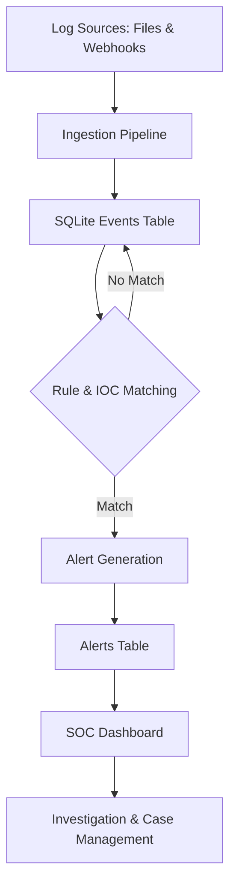

# Threat Hunting Platform

[](https://github.com/manan-m-shah/threat-hunting-platform)
[](https://opensource.org/licenses/MIT)

The Threat Hunting Platform is a Python-based security monitoring and detection prototype designed to simulate the core workflow of a modern Security Operations Center (SOC). The system collects logs, stores them in a database, evaluates them against hunting rules, enriches alerts with MITRE ATT&CK context, and presents the output in a web-based dashboard for investigation and case tracking.

This project provides a practical, hands-on tool for learning about security operations, detection engineering, and incident response workflows.


## ✨ Features

- **Auth + RBAC**: Username/password login, hashed passwords, session tokens, explicit permissions (`admin` / `analyst` / `viewer`).
- **Role-specific UI**: Sidebar navigation with ProtectedRoute gates (dashboard, alerts, hunting, cases, intelligence, webscan, reports, admin).
- **Real-time log ingestion**: Background watcher tails `backend/data/logs/` with offset tracking.
- **Detection engine**: YAML rules, IOC matching, YARA, MITRE ATT&CK mapping, risk scoring, alert correlation.
- **Cases & incidents**: Create cases from alerts; correlated incident timelines.
- **Assets & TI**: Asset inventory + enriched IOC store / feed sync.
- **Audit logging**: Append-only audit trail for login, RBAC, SOAR, scans.
- **Authorized web scanner**: Safe TLS/header/cookie checks on AUTHORIZED targets only.
- **SOAR (simulation)**: Permissioned simulated response actions with clear SIMULATION MODE labeling.
- **Live Socket.IO alerts** and **PDF incident reports**.

Detailed docs: [`docs/FULL_PLATFORM_REPORT.md`](./docs/FULL_PLATFORM_REPORT.md) · [`docs/ARCHITECTURE.md`](./docs/ARCHITECTURE.md) · [`docs/API.md`](./docs/API.md) · [`docs/RBAC.md`](./docs/RBAC.md)

## 🏗️ Architecture

The platform is built with a modular architecture, separating the backend API (Flask) from the frontend UI (React).

### Core Workflow



## 🛠️ Tech Stack

| Component | Technology |
|-----------|------------|
| **Backend** | Python, Flask, SQLAlchemy, Flask-SocketIO |
| **Frontend**| React, Axios, Recharts, Mantine UI |
| **Database**| SQLite |
| **Detection**| PyYAML, YARA, Requests, ReportLab |

## 🚀 Getting Started

Follow these instructions to get a local copy up and running.

### Prerequisites

- Python 3.8+
- Node.js v16+ and npm

### 1. Clone the Repository

```bash
git clone https://github.com/manan-m-shah/threat-hunting-platform.git
cd threat-hunting-platform
```

### 2. Backend Setup

```bash
cd backend
python -m venv venv
# Windows:
venv\Scripts\activate
# Linux/macOS:
# source venv/bin/activate

pip install -r requirements.txt
```

Configure the admin password (required for a known initial password):

```bash
# Linux/macOS
export TH_ADMIN_PASSWORD="YourSecurePassword123!"

# Windows (Command Prompt)
set TH_ADMIN_PASSWORD=YourSecurePassword123!

# Windows (PowerShell)
$env:TH_ADMIN_PASSWORD="YourSecurePassword123!"
```

If unset, a random one-time password is printed on first run.

### 3. Frontend Setup

```bash
cd frontend
npm install
# Optional: copy .env.example to .env and set REACT_APP_API_BASE_URL
```

## 🏃 Running the Application

Backend and frontend are separated under `backend/` and `frontend/`.

Detailed feature docs:

- Backend → [`BACKEND.md`](./BACKEND.md)
- Frontend → [`FRONTEND.md`](./FRONTEND.md)

### Start the Backend Server

```bash
cd backend
venv\Scripts\activate
set PYTHONPATH=src
python -m th.webapp
# → http://127.0.0.1:5000
```

SQLite DB `threat_hunting.db` is created under `backend/`.

### Start the Frontend UI

```bash
cd frontend
npm start
# → http://localhost:3000
```

API base defaults to `http://127.0.0.1:5000` via `REACT_APP_API_BASE_URL`.

### Login

- **URL**: `http://localhost:3000`
- **Username**: `admin`
- **Password**: value of `TH_ADMIN_PASSWORD`

## 📈 Populating with Data

**Warning**: This deletes existing events and alerts from `backend/threat_hunting.db`.

```bash
cd backend
venv\Scripts\activate
python generate_mass_data.py
```

## ⚙️ Usage

Once logged in, you can explore the platform's features:

- **Dashboard**: View a live summary of alerts, key performance indicators (KPIs), and system status.
- **Alert Investigation**: Click on an alert to view its detailed context, related events, and update its case status.
- **Analytics**: Explore trends, MITRE ATT&CK heatmaps, and top host activity.
- **Admin**: Manage users, IOC feeds, and create suppression rules to tune out noise.
- **Sigma Import**: Upload a Sigma rule file to automatically convert it into a local detection rule.
- **Feed Sync**: Manually trigger a synchronization with configured threat intelligence feeds.

## 📡 Live Log Ingestion

The platform supports live log ingestion via a secure webhook endpoint, ideal for cloud services with log drain capabilities (e.g., Vercel, Heroku).

- **Endpoint**: `POST /api/ingest_logs`
- **Authentication**: Requires a valid API key sent in the `X-Ingest-Key` header.
- **Payload**: Accepts a JSON payload containing a single log object or a list of log objects.

API keys can be created and managed in the Admin panel.

## 📁 Project Structure

```
Threat-Hunting-Platform/
├── BACKEND.md              # Backend features & API docs
├── FRONTEND.md             # Frontend features & UI docs
├── README.md
├── package.json            # Optional: run both apps together
├── backend/                # Python Flask API + detection engine
│   ├── requirements.txt
│   ├── hunting_rules.yml
│   ├── data/logs/
│   ├── rules/
│   ├── scripts helpers (setup_admin.py, generate_*.py)
│   ├── tests/
│   └── src/th/             # webapp, pipeline, db, scanner, ...
└── frontend/               # React SIEM dashboard
    ├── package.json
    ├── .env.example
    ├── public/
    └── src/
```

Recommended deeper modular layout is documented in `BACKEND.md` §10 and `FRONTEND.md` §9.

## 🔮 Future Scope

- Integration with more log sources (e.g., Sysmon, OSQuery).
- Advanced alert correlation engine.
- Support for alternative databases like PostgreSQL.
- More comprehensive role-based access control (RBAC).
- Automated SOAR playbooks for response actions.


*This project is for educational and demonstration purposes and is not intended for production use without further hardening and testing.*

## 🧠 Skills Demonstrated

- Security Operations (SOC)
- Threat Hunting & Detection Engineering
- SIEM Development
- Python Backend Engineering
- React Dashboard Development
- Data Processing Pipelines
- Cyber Threat Intelligence (CTI)

## License

This project is licensed under the MIT License.
---

## 📌 Author

Manan Mandal  
Cybersecurity Enthusiast | SOC | Threat Hunting | SIEM Engineering# Threat-Hunting-Platform
# Threat-Hunting-Platform

