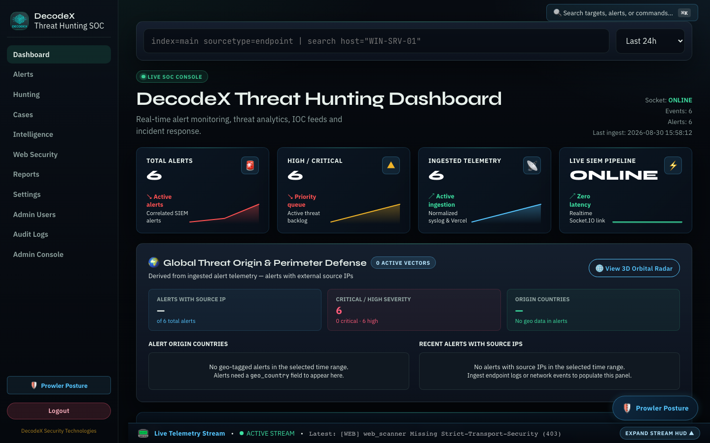
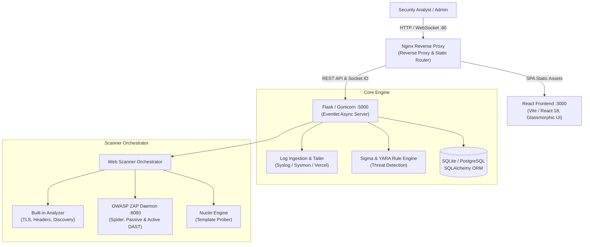

# DecodeX — Threat Hunting, SIEM & Web Application Security Platform

> [!WARNING]
> ### ⚠️ AUTHORIZED USE & LEGAL DISCLAIMER
> **DecodeX is a dual-capability threat detection and active security testing platform.**
> - **Real Attack Payloads**: The dynamic application security testing (DAST) engine utilizes an integrated OWASP ZAP daemon and custom discovery engines that transmit **real, active attack payloads** (including SQL injection strings, cross-site scripting vectors, directory/path traversal sequences, and automated API fuzzing).
> - **Strict Authorization Required**: You must **only** scan, probe, or test web targets and network endpoints that you legally own or for which you have obtained **explicit, documented, prior written authorization** from the target owner.
> - **Legal Consequences**: Unauthorized access, penetration testing, or vulnerability scanning against systems without formal permission is strictly prohibited and constitutes a violation of computer crime statutes globally, including the **Computer Fraud and Abuse Act (CFAA, 18 U.S.C. § 1030)** in the United States, the **Computer Misuse Act 1990** in the United Kingdom, and corresponding cybercrime legislation in your jurisdiction.
> - **No Maintainer Liability**: The authors, maintainers, and contributors of DecodeX assume **no liability** and are not responsible for any misuse, damage, data loss, service degradation, or legal repercussions incurred through the deployment or operation of this software. By running DecodeX, you accept full responsibility for your actions.

---

[](https://opensource.org/licenses/Apache-2.0)
[](https://github.com/Decoder420/DecodeX-Threat-Hunting-Platform/actions/workflows/ci.yml)
[](backend/tests/)
[](docker-compose.yaml)
[](backend/)
[](frontend/)
[](https://www.zaproxy.org/)

**DecodeX** is an open-source Security Operations Center (SOC), Threat Hunting, and Web Application Security (DAST) platform. It unifies log ingestion, Sigma rule evaluation, in-memory YARA malware inspection, and incident case escalation with active web attack surface discovery, OWASP ZAP automated crawling, hierarchical attack surface visualization, and cryptographically encrypted target credential vaulting.

---

## 📸 Interface Preview

| SOC Executive Telemetry & Detection Workbench | Interactive Website Attack Surface Map |
| :---: | :---: |
|  |  |

---

## ⚡ Quickstart (One-Command Evaluation)

The fastest way to evaluate DecodeX locally is using the first-run initializer script. It verifies your Docker environment, auto-generates high-entropy evaluation keys (`ENCRYPTION_KEY`, `SECRET_KEY`, `ZAP_API_KEY`) into `.env`, and boots all four microservices.

```bash
# 1. Clone the repository
git clone https://github.com/Decoder420/DecodeX-Threat-Hunting-Platform.git
cd DecodeX-Threat-Hunting-Platform

# 2. Run the evaluation setup script
./scripts/first-run.sh
```

### Accessing the Platform:
- **Web UI**: Open [http://localhost](http://localhost) in your browser.
- **Default Roles & Initial Passwords**:
  - **Administrator (`admin`)**: `ChangeMe_Admin_Password123!` (Full system, user management, and target authorization).
  - **Security Analyst (`analyst`)**: `ChangeMe_Analyst_Password123!` (Alert triage, case promotion, scanning, and IOC sync).
  - **Viewer (`viewer`)**: `ChangeMe_Viewer_Password123!` (Read-only dashboards and reports).

> [!NOTE]
> The auto-generated keys and default passwords initialized by `./scripts/first-run.sh` are intended strictly for **local evaluation**. In production environments, configure dedicated secrets manually in `.env`.

---

## 🌟 Core Modules & Capabilities

### 1. 🛡️ Security Operations Center (SOC) & SIEM
- **Structured Log Ingestion**: Real-time background directory tailer and REST API (`POST /api/ingest_logs`) supporting Sysmon, Windows Event Logs, Linux authentication records, and web server logs.
- **Rule Evaluator & Sigma Importer**: YAML-driven detection rules with MITRE ATT&CK tactics, techniques, and automated scoring.
- **YARA Pattern Matching**: Compiled binary scanning engine with bounded execution timeouts and payload size limits.
- **Threat Intelligence Feeds**: In-memory watchlist store (IPv4, Domains, Hashes) with live background feed collectors and one-click reputation lookups (AbuseIPDB, VirusTotal).
- **Incident Forensics Drawer & Cases**: Deep drill-downs into raw log lines, parent/child process trees, analyst annotation logs, and SOAR simulated containment (host isolation, firewall block, process kill).

### 2. 🌐 Web Application Security & DAST Scanner
- **Target Safety Isolation (`lab` vs `production`)**:
  - `production`: Strictly enforces passive non-destructive analysis (TLS configuration, HTTP security headers, sitemap checks, and passive spidering). Aggressive attack payloads are disabled.
  - `lab`: Authorizes full active scanning with ZAP attack strength and alert threshold controls against targets you explicitly own.
- **SSRF Defensive Guardrails**: Multi-step DNS resolution checks block private RFC-1918 addresses, loopbacks (`127.0.0.1`), and cloud metadata IP ranges (`169.254.169.254`) before scan dispatch.
- **Authenticated Crawling & Encrypted Vault**: Stores scan credentials encrypted at rest using AES-128-CBC + HMAC-SHA256 (`cryptography.fernet.Fernet`). Fails closed loudly if keys are missing (`VaultConfigurationError`).
- **Interactive Website Tree**: Hierarchical asset explorer rendering spidered URLs, endpoints, parameters, and risk markers in real time.
- **Scan Comparison & Differential Analysis**: API endpoint (`/api/web-scans/<id>/compare/<other_id>`) identifying new, resolved, and persistent vulnerabilities across scan runs.

### 3. 📄 Automated Reporting & Auditing
- **Executive & Technical PDF Reports**: One-click generation of branded vulnerability and incident reports with executive summaries, CVSS severity breakdowns, and remediation advice.
- **Immutable Audit Trail**: Append-only audit logger capturing all user authentications, permission modifications, target authorizations, and scans.

---

## 🏗️ Platform Architecture

DecodeX is architected as an event-driven containerized microservices stack:



---

## 📚 Technical Documentation & Deep Dives

For exhaustive documentation on specific subsystems, consult our guides:

- **[SECURITY.md](SECURITY.md)**: Role-based access control (RBAC), credential encryption vault, SSRF guardrails, login rate limiting, and safe configuration.
- **[CONTRIBUTING.md](CONTRIBUTING.md)**: Local development setup, testing workflows, coding standards, and security PR review criteria.
- **[docs/BACKEND.md](docs/BACKEND.md)**: Python service architecture, database schemas, and REST/WebSocket API contracts.
- **[docs/FRONTEND.md](docs/FRONTEND.md)**: React components, state management, design tokens, and HUD telemetry tickers.
- **[CHANGELOG.md](CHANGELOG.md)**: Complete security hardening and feature release history.
- **[docs/GIT_HISTORY_SCRUB_RUNBOOK.md](docs/GIT_HISTORY_SCRUB_RUNBOOK.md)**: Step-by-step instructions for repository history sanitization with `git-filter-repo`.

---

## 📌 Project Status & Honest Expectations

DecodeX is an **actively developed open-source cybersecurity platform**, engineered for security researchers, detection engineers, and purple teams evaluating threat hunting workflows in lab, staging, and controlled testing environments.

- **What It Is**: A modular, observable, and fully functional platform that connects defensive detection engineering (Sigma/YARA/SIEM) with offensive attack surface management (DAST/OWASP ZAP).
- **What It Is Not**: DecodeX is not an off-the-shelf enterprise appliance certified for unregulated multi-tenant SaaS hosting. It does not provide built-in hardware appliance clustering, distributed Kubernetes operator scaling, or legal compliance certifications (e.g. SOC 2, FedRAMP).
- **Operational Guidance**: Before deploying DecodeX against internet-facing endpoints or untrusted multi-user networks, operators must conduct internal threat modeling, enforce network perimeter firewalls, and pin production environment keys.

---

## 💬 Community & Contributing

- **Discussions**: Ask questions, share hunting rules, or propose scanner features in [GitHub Discussions](https://github.com/Decoder420/DecodeX-Threat-Hunting-Platform/discussions).
- **Issue Tracking**: Report bugs or suggest enhancements via [GitHub Issues](https://github.com/Decoder420/DecodeX-Threat-Hunting-Platform/issues).
- **Security Vulnerabilities**: For private, responsible disclosure, please use [GitHub Security Advisories](https://github.com/Decoder420/DecodeX-Threat-Hunting-Platform/security/advisories/new) or email `mananmandal006@gmail.com` directly. See [SECURITY.md](SECURITY.md).

---

## ⚖️ License & Copyright

Copyright © 2026 **DecodeX Security Technologies Private Limited**.  
Licensed under the [Apache License, Version 2.0](LICENSE).

**Engineered by Manan Mandal ([@Decoder420](https://github.com/Decoder420))**  
*Cybersecurity • Threat Hunting • Detection Engineering • SOC Operations*
