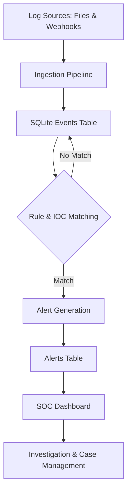

# Threat Hunting Platform

[](https://github.com/manan-m-shah/threat-hunting-platform)
[](https://opensource.org/licenses/MIT)

The Threat Hunting Platform is a Python-based security monitoring and detection prototype designed to simulate the core workflow of a modern Security Operations Center (SOC). The system collects logs, stores them in a database, evaluates them against hunting rules, enriches alerts with MITRE ATT&CK context, and presents the output in a web-based dashboard for investigation and case tracking.

This project provides a practical, hands-on tool for learning about security operations, detection engineering, and incident response workflows.


## ✨ Features

- **Multi-Source Log Ingestion**: Ingest logs from local files and live webhook streams (e.g., from cloud providers).
- **Persistent Storage**: Uses SQLite to store events, alerts, IOCs, and case data.
- **Rule-Based Detection**: Employs a flexible YAML-based rule engine for creating custom detections.
- **YARA Scanning**: Scans log data with YARA rules for pattern matching.
- **IOC Matching**: Correlates events against a watchlist of Indicators of Compromise (IPs, domains, hashes).
- **Threat Intelligence Feeds**: Syncs with external threat intel feeds to keep IOCs current.
- **Sigma Rule Importer**: Converts community-standard Sigma rules into the local format.
- **MITRE ATT&CK Mapping**: Enriches alerts with ATT&CK tactics and techniques for better context.
- **Interactive SOC Dashboard**: A React-based frontend for viewing alerts, managing cases, and visualizing data.
- **Alert Investigation & Case Management**: Track alert status (`Open`, `In Progress`, `Resolved`), assign analysts, and add notes.
- **User Authentication**: Secure login system with hashed passwords and role-based access (`admin`, `analyst`).
- **Live Updates**: Uses WebSockets to push new alerts and updates to the dashboard in real-time.
- **Admin Panel**: Manage users, threat intelligence feeds, and suppression rules.
- **PDF Reporting**: Generate PDF incident reports directly from an alert.

## 🏗️ Architecture

The platform is built with a modular architecture, separating the backend API (Flask) from the frontend UI (React).

### Core Workflow



## 🛠️ Tech Stack

| Component | Technology |
|-----------|------------|
| **Backend** | Python, Flask, SQLAlchemy, Flask-SocketIO |
| **Frontend**| React, Axios, Recharts, Mantine UI |
| **Database**| SQLite |
| **Detection**| PyYAML, YARA, Requests, ReportLab |

## 🚀 Getting Started

Follow these instructions to get a local copy up and running.

### Prerequisites

- Python 3.8+
- Node.js v16+ and npm

### 1. Clone the Repository

```bash
git clone https://github.com/manan-m-shah/threat-hunting-platform.git
cd threat-hunting-platform
```

### 2. Backend Setup

First, set up the Python environment and install dependencies.

```bash
# Create and activate a virtual environment
python -m venv venv
source venv/bin/activate  # On Windows, use `venv\Scripts\activate`

# Install Python packages
pip install flask flask_cors flask_socketio sqlalchemy "werkzeug<3.0" yara-python pyyaml requests reportlab rich
```

Next, configure the admin password. The system requires an environment variable for the initial `admin` user's password.

```bash
# For Linux/macOS
export TH_ADMIN_PASSWORD="YourSecurePassword123!"

# For Windows (Command Prompt)
set TH_ADMIN_PASSWORD="YourSecurePassword123!"

# For Windows (PowerShell)
$env:TH_ADMIN_PASSWORD="YourSecurePassword123!"
```

If this variable is not set, a random one-time password will be generated and printed to the console on the first run.

### 3. Frontend Setup

In a separate terminal, navigate to the `siem-ui` directory and install the Node.js dependencies.

```bash
cd siem-ui
npm install
```

## 🏃 Running the Application

### Configure the API Endpoint

Before running, ensure the frontend knows where to find the backend API. Open `siem-ui/src/api.js` and change the `API_BASE_URL` to point to your local backend server.

```javascript
// siem-ui/src/api.js
const API_BASE_URL = "http://127.0.0.1:5000";
```

### Start the Backend Server

With your Python virtual environment activated, run the Flask web application from the project root.

```bash
# Make sure you are in the root directory of the project
# The backend will run on http://127.0.0.1:5000 by default
python src/th/webapp.py
```

The database `threat_hunting.db` will be created in the root directory.

### Start the Frontend UI

In the terminal where you set up the frontend, run the React development server.

```bash
# Make sure you are in the siem-ui/ directory
npm start
```

The frontend will open automatically in your browser at `http://localhost:3000`.

### Login

- **URL**: `http://localhost:3000`
- **Username**: `admin`
- **Password**: The password you set in the `TH_ADMIN_PASSWORD` environment variable.

## 📈 Populating with Data

To fill the database with realistic sample data for demonstration purposes, you can run the data generation script.

**Warning**: This will delete existing events and alerts from `threat_hunting.db`.

```bash
# Make sure your venv is active and you are in the project root
python generate_mass_data.py
```

## ⚙️ Usage

Once logged in, you can explore the platform's features:

- **Dashboard**: View a live summary of alerts, key performance indicators (KPIs), and system status.
- **Alert Investigation**: Click on an alert to view its detailed context, related events, and update its case status.
- **Analytics**: Explore trends, MITRE ATT&CK heatmaps, and top host activity.
- **Admin**: Manage users, IOC feeds, and create suppression rules to tune out noise.
- **Sigma Import**: Upload a Sigma rule file to automatically convert it into a local detection rule.
- **Feed Sync**: Manually trigger a synchronization with configured threat intelligence feeds.

## 📡 Live Log Ingestion

The platform supports live log ingestion via a secure webhook endpoint, ideal for cloud services with log drain capabilities (e.g., Vercel, Heroku).

- **Endpoint**: `POST /api/ingest_logs`
- **Authentication**: Requires a valid API key sent in the `X-Ingest-Key` header.
- **Payload**: Accepts a JSON payload containing a single log object or a list of log objects.

API keys can be created and managed in the Admin panel.

## 📁 Project Structure

```
/
├── data/
│   └── logs/             # Sample log files for ingestion
├── hunting_rules.yml     # Main detection rules
├── siem-ui/              # React frontend application
│   ├── public/
│   └── src/
├── src/
│   └── th/               # Core Python backend source
│       ├── rules/        # YARA rules
│       ├── anomaly.py    # Anomaly detection logic
│       ├── db.py         # SQLAlchemy models and DB setup
│       ├── feed_collector.py # Threat intel feed syncing
│       ├── main.py       # CLI entrypoint for batch processing
│       ├── pipeline.py   # Core ingestion/detection logic
│       ├── rule_evaluator.py # YAML rule matching
│       ├── scanner.py    # YARA scanning
│       ├── sigma_importer.py # Sigma rule conversion
│       └── webapp.py     # Flask web application & API
├── threat_hunting.db     # SQLite database file (created on run)
└── README.md             # This file
```

## 🔮 Future Scope

- Integration with more log sources (e.g., Sysmon, OSQuery).
- Advanced alert correlation engine.
- Support for alternative databases like PostgreSQL.
- More comprehensive role-based access control (RBAC).
- Automated SOAR playbooks for response actions.


*This project is for educational and demonstration purposes and is not intended for production use without further hardening and testing.*

## 🧠 Skills Demonstrated

- Security Operations (SOC)
- Threat Hunting & Detection Engineering
- SIEM Development
- Python Backend Engineering
- React Dashboard Development
- Data Processing Pipelines
- Cyber Threat Intelligence (CTI)

## License

This project is licensed under the MIT License.
---

## 📌 Author

Manan Mandal  
Cybersecurity Enthusiast | SOC | Threat Hunting | SIEM Engineering# Threat-Hunting-Platform
# Threat-Hunting-Platform

